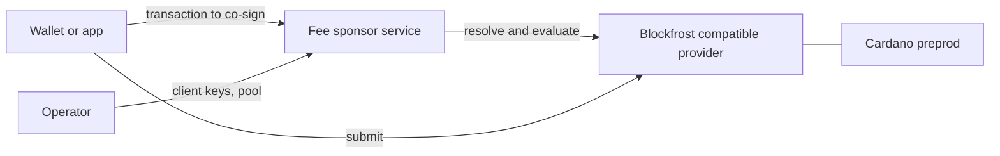

# Cardano Account Custody Fee Sponsor

An HTTP service that adds a funded wallet's signature to transactions of the
[account custody contract](https://github.com/Biglup/cardano-account-custody-contract),
under a fixed policy.

> [!WARNING]
> The service has not been audited, and it runs on the Cardano preprod network
> only. [docs/verification.md](docs/verification.md) says how it is verified.
> [docs/security/known-issues.md](docs/security/known-issues.md) lists the
> risks that remain.

## What it does

A custody account is owned by device keys whose holders may hold no ADA. The
account still needs ADA to be created, and collateral for every transaction
that runs its scripts. The fee sponsor holds one funded wallet and supplies
both.

The client builds the transaction, asks the service for the sponsor's
signature, adds its own signatures and submits. The service signs only a
transaction that passes its [policy](docs/policy.md), and it records every
decision on an audit trail. The package also exports a client adapter, so the
contract's own transaction builders use the service as a wallet.

[docs/overview.md](docs/overview.md) explains what the service signs and what
it never signs.

## Where it sits



## Two modes

In fee mode, a client leases one of the sponsor's fee UTxOs, and the sponsor
pays for an account creation. In collateral mode, the account pays its own
way, and the sponsor lends its shared collateral with no lease.
[The two modes](docs/overview.md#the-two-modes) compares them.

## Quick start

A hosted instance serves preprod at `https://sponsor-preprod.lw.iog.io`. Its
operator issues the client keys.

To run your own, the container image is
`ghcr.io/biglup/cardano-account-custody-fee-sponsor`. Put the required
variables of [docs/operators/configuration.md](docs/operators/configuration.md)
in an environment file, then start the image:

```sh
docker run --detach --name sponsor \
  --env-file sponsor.env \
  --volume sponsor-data:/data \
  --publish 127.0.0.1:8787:8787 \
  ghcr.io/biglup/cardano-account-custody-fee-sponsor:latest
```

Once the container logs `Fee sponsor service listening`, check it:

```sh
curl http://127.0.0.1:8787/health
```

The answer carries the network and the pool counts. Fund the sponsor address
and fill the pool, as [First start](docs/operators/deployment.md#first-start)
describes. A deployment pins the image by digest, as
[docs/operators/deployment.md](docs/operators/deployment.md#pin-by-digest)
describes.

Then follow [docs/integrators/quickstart.md](docs/integrators/quickstart.md)
to create an account with the sponsor paying, and to spend from it with the
sponsor lending collateral.

## Documentation

[docs/README.md](docs/README.md) gives the purpose of every document.

### Integrators

- [Overview](docs/overview.md): what the service is and what it signs
- [Quick start](docs/integrators/quickstart.md): a first creation and spend
- [Flows](docs/integrators/flows.md): both modes and the lease lifecycle
- [API reference](docs/integrators/api.md): every route
- [Errors](docs/integrators/errors.md): every error code and its fix
- [Retries and idempotency](docs/integrators/retries-and-idempotency.md):
  when to present a transaction again
- [Client adapter](docs/integrators/client-adapter.md): `SponsorWallet`
- [Glossary](docs/glossary.md): the service's terms

### Operators

- [Configuration](docs/operators/configuration.md): every variable
- [Deployment](docs/operators/deployment.md): the image, its state and its
  exposure
- [The pool](docs/operators/pool.md): fee and collateral UTxOs, and
  replenishing
- [Monitoring](docs/operators/monitoring.md): health, logs and the audit
  trail
- [Runbook](docs/operators/runbook.md): routine tasks and incidents

### Auditors

- [Policy](docs/policy.md): the rules a transaction must pass, POL-1 to
  POL-12
- [Threat model](docs/security/threat-model.md): attacks and the defence
  against each
- [Known issues](docs/security/known-issues.md): the risks that remain
- [Verification](docs/verification.md): how the service is verified
- Decisions:
  [0001 shared collateral without a lease](docs/adr/0001-shared-collateral-without-a-lease.md),
  [0002 fee mode for creation only](docs/adr/0002-fee-mode-for-creation-only.md),
  [0003 verify the script data hash](docs/adr/0003-verify-the-script-data-hash.md),
  [0004 creation must derive from a listed device](docs/adr/0004-creation-must-derive-from-a-listed-device.md)
- Evidence: [the hosted instance on preprod](docs/preprod-hosted-evidence.md),
  [a run against a local service](docs/preprod-evidence.md)

### Contributors

- [CONTRIBUTING.md](CONTRIBUTING.md): build, test and prove the service from a
  checkout

## License

Apache-2.0. See [LICENSE](LICENSE).
