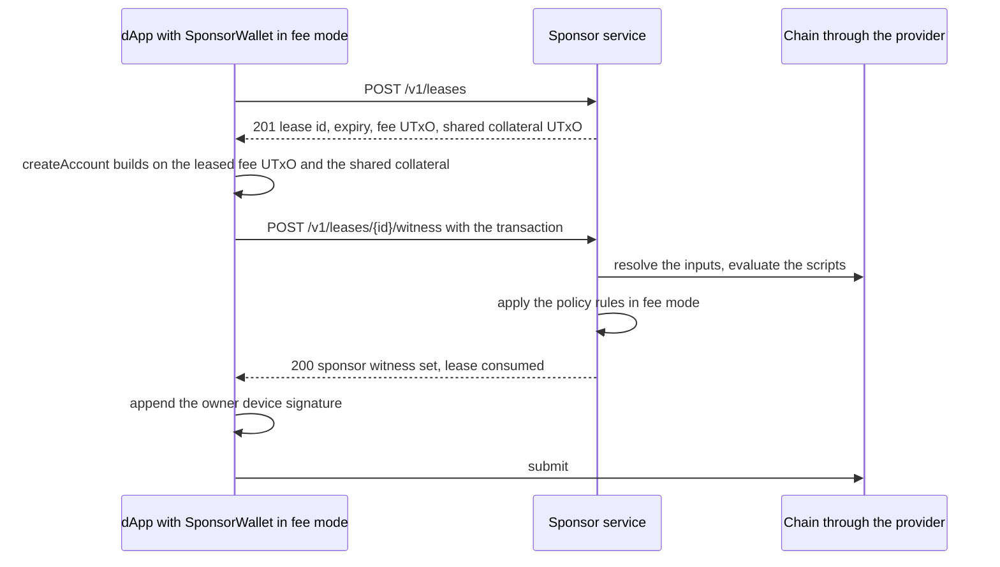
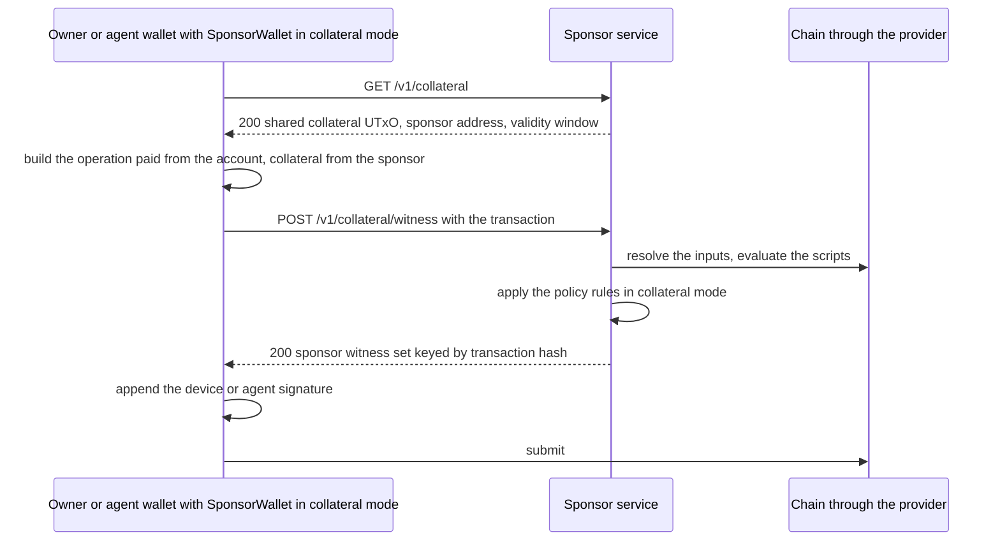

# Cardano Account Custody Fee Sponsor

An HTTP service that holds one funded Cardano wallet and signs, as that
wallet, transactions other people build for the
[account custody contract](https://github.com/Biglup/cardano-account-custody-contract).
It leases fee UTxOs to clients, shares one collateral UTxO with every
transaction, checks each transaction against a fixed policy before
signing, and records every decision. The package also exports a client
adapter that implements cometa's `Wallet` interface over the API, so the
contract's own builders work unchanged.

## What it is for

A custody account is created by a device key whose owner may hold no
ADA. Creation costs a fee, a stake registration deposit and the lovelace
of the control UTxO, and it needs collateral because the account scripts
run. The service lets a dApp pay for that: it leases one of its fee
UTxOs to the dApp, the dApp builds the creation on it, and the service
signs once the transaction draws nothing from the sponsor beyond the fee,
the deposit and the control UTxO.

Every later operation is paid by the account from its own UTxOs: an
owner operation from an account reserve, a deposit under a datum that
the owner alone can spend, or from the plain funds, and an agent spend,
which spends its grant UTxO and plain funds and references the control
UTxO without spending it, from the plain funds. An account reserve is
the contract's; the sponsor's reserve, the wallet's UTxOs outside the
pool, is another thing and is described under Pool. What the owner or an
agent still lacks is collateral, which only a wallet with ADA can
declare. For those transactions the service contributes its shared
collateral UTxO alone, signs the collateral declaration, and no sponsor
lovelace is spent.

Two modes follow from this, both served by the same policy:

- Fee mode: a leased fee UTxO pays for an account creation, drawn down
  by exactly the fee, the deposit and the control UTxO, and for nothing
  else: an operation on an existing account presented on this route is
  refused, since the account pays for it.
- Collateral mode: no sponsor UTxO is spent and no output pays the
  sponsor; the sponsor declares collateral and nothing else, for any
  operation on an existing account.

### The contract the policy reads

Every account pays to one permanent script, the account proxy, whose
hash is `ACCOUNT_SCRIPT_HASH` and is also the policy of every account
token. The proxy holds no rules of its own: the account's rules live in
a logic script, named by hash in the first field of the control UTxO's
datum, and the proxy runs it by requiring a withdrawal of zero from that
logic's reward account on every transaction that spends an account UTxO
or mints under the policy, bar a plain deposit. An account moves to
another version of its rules by writing a different logic into its
control output, and that upgrade withdraws from both the logic it leaves
and the one it arrives at. An upgrade cannot embed both logics, since
two logic scripts and the proxy exceed the 16 KiB transaction size
limit, so an upgrade references parked copies of the logics instead.

The service therefore reads the logic a transaction names and refuses
any it does not know, under `known_logic`: an account whose rules the
operator has never read is not one the sponsor pays for or lends
collateral to. `KNOWN_LOGIC_HASHES` is the list it serves.

The contract carries two logic versions, and the list defaults to both:
`2cd68e398bdf9fbc8d257614b54403451ee722520ec785fe14f8df5a` for logic v1,
which is the version a new account is created under, and
`69baa8a8c877247028c56c8130449e186e3658d541536d168f92db3d` for logic v2,
the version an account arrives at when its devices sign an upgrade. Both
are served because an upgrade runs both logics and accounts sit on either
side of it for as long as the upgrade window lasts: serving v1 alone
would refuse the upgrade itself, and serving v2 alone would strand every
account that has not moved yet.

The proxy and the logic are large scripts, so a network usually parks
them in UTxOs at an address nobody can spend from and transactions
reference them instead of carrying them. Such a reference input sits at
a foreign address and is allowed, but a reference input is never read as
an input: it is neither the sponsor's nor an account's, and it names no
logic and no stake script. Only a control UTxO, spent or referenced at
the account address its token is named after, does that.

## Flows

### Sponsored creation, fee mode



### Account operation, collateral mode



The service never submits a transaction; the client appends the sponsor
witness set with `applyVkeyWitnessSet` and submits through its provider.

## API

Every route except `GET /health` takes `Authorization: Bearer <key>`.
The `/v1` routes take a client key issued by the admin routes; the
`/admin` routes take `ADMIN_API_KEY`. Bodies are JSON and capped at
64 KiB. Every error is a JSON body `{ "error": "<code>" }` with an
optional `detail` sentence and, for a policy refusal, the `rule` that
failed.

Answers every route can give:

- 401 `unauthorized`: the key is missing, unknown or disabled, which a
  client route answers alike, or, on an admin route, not the admin key.
- 400 `invalid_request`: the body or query does not match the route, or
  the JSON does not parse. The detail names the first field at fault.
- 413 `payload_too_large`: the body is over 64 KiB.
- 429 `rate_limited`: the address or the key made its requests for the
  minute; see Quotas and rate limits.
- 404 `not_found`: no route matches.
- 500 `internal_error`: an error the service did not anticipate. The
  body carries nothing else.

### `GET /health`

Answers 200 with the network and the pool counts:

```json
{
  "ok": true,
  "network": "preprod",
  "pool": {
    "fee": { "free": 5, "leased": 0 },
    "collateral": { "shared": true, "spare": 1, "consumed": 0 }
  }
}
```

`shared` says whether a collateral UTxO is designated, `spare` how many
free collateral UTxOs stand behind it, and `consumed` how many shared
collateral UTxOs were ever taken by the chain.

### `POST /v1/leases`

Reserves the oldest free fee UTxO for the key for `LEASE_TTL_SECONDS`
and answers 201:

```json
{
  "leaseId": "b26ee940-dd6d-4456-b6c4-8336af3364ff",
  "expiresAt": "2026-10-07T13:40:45.753Z",
  "fee": { "txHash": "4c08...31f2", "index": 1, "address": "addr_test1...", "lovelace": 95485676 },
  "collateral": { "txHash": "1874...f2d0", "index": 1, "address": "addr_test1...", "lovelace": 5000000 },
  "sponsorAddress": "addr_test1...",
  "maxSponsoredLovelace": 6000000
}
```

`collateral` is the shared collateral UTxO as of the answer; it is not
reserved for the lease. A fee UTxO backs one open lease at a time.

- 429 `quota_exceeded`, detail `open_leases: at most N open leases per key`.
- 409 `no_utxo_available` when every fee UTxO is leased (the detail says
  how many and when the soonest lease expires), or when the pool holds
  no fee UTxO or no collateral UTxO yet and the sponsor's reserve could
  fund one by replenishing. The pool is resynced with the chain once before this
  answer.
- 503 `out_of_funds` when the pool holds no fee UTxO or no collateral
  UTxO and the reserve cannot fund a split of that size.

### `DELETE /v1/leases/:id`

Releases an open lease so its fee UTxO is free at once. Answers 200
`{ "leaseId": "...", "status": "released" }`, also for a lease already
released.

- 404 `unknown_lease` for an id the key does not hold.
- 410 `lease_expired` for a lease past its TTL.
- 409 `lease_consumed` for a lease that issued its witness.

### `POST /v1/leases/:id/witness`

Body `{ "transaction": "<unsigned transaction as CBOR hex>" }`. Checks
the transaction in fee mode, which serves an account creation only, and
answers 200:

```json
{ "witnessSet": "a10081825820...", "leaseId": "b26ee940-dd6d-4456-b6c4-8336af3364ff" }
```

`witnessSet` is a transaction witness set as CBOR hex holding the
sponsor payment key's signature and nothing else. A lease issues one
witness and is consumed by it; the same transaction presented again on
the consumed lease, even at the same moment, receives the same witness
set.

- 404 `unknown_lease`.
- 410 `lease_expired`, detail `Lease ... has expired` or `Lease ... was released`.
- 422 `invalid_transaction` with `rule` naming the first policy rule that
  failed and `detail` saying how; an operation on an existing account,
  which the fee route does not pay for, is refused here under
  `sponsor_outflow_bounded`, and a transaction whose witness set does not
  match the script data hash its body commits to under
  `script_data_hash`. The lease stays open.
- 409 `lease_consumed` for a different transaction on a consumed lease.
- 429 `quota_exceeded`, detail `witnesses_per_hour: ...` or
  `sponsored_lovelace_per_day: ...`. The lease stays open.
- 409 `no_utxo_available` or 503 `out_of_funds` when the pool holds no
  collateral UTxO at the time of signing, as for a lease.

### `GET /v1/collateral`

Answers 200 with the shared collateral UTxO, for a client whose
transaction pays its own fee:

```json
{
  "txHash": "1874...f2d0",
  "index": 1,
  "address": "addr_test1...",
  "lovelace": 5000000,
  "sponsorAddress": "addr_test1...",
  "validitySeconds": 600
}
```

The collateral return must pay `sponsorAddress`, and the validity upper
bound may reach at most `validitySeconds` from the time of the witness
request.

- 409 `no_utxo_available` or 503 `out_of_funds` when the pool holds no
  collateral UTxO, as for a lease.

### `POST /v1/collateral/witness`

Body `{ "transaction": "<unsigned transaction as CBOR hex>" }`. Checks
the transaction in collateral mode and answers 200:

```json
{ "witnessSet": "a10081825820...", "txHash": "d886...4d03" }
```

No lease is involved. The witness is keyed by the transaction hash: the
same transaction presented again, by any key, receives the same witness
set.

- 422 `invalid_transaction` with `rule` and `detail`; a transaction whose
  witness set does not match the script data hash its body commits to is
  refused under `script_data_hash`.
- 429 `quota_exceeded` under the key's witness quotas; a collateral
  witness sponsors zero lovelace, so the hourly witness quota is the one
  that applies.
- 409 `no_utxo_available` or 503 `out_of_funds` when the pool holds no
  collateral UTxO.

### `POST /admin/keys`

Body `{ "label": "<1 to 100 characters>", "quotas": { ... } }`, quotas
optional with any of `openLeases`, `witnessesPerHour` and
`sponsoredLovelacePerDay` as positive integers. Answers 201:

```json
{
  "apiKey": "<shown once>",
  "id": 1,
  "label": "my dapp",
  "quotas": { "openLeases": 5, "witnessesPerHour": 60, "sponsoredLovelacePerDay": 600000000 }
}
```

The key is stored as its SHA-256 hash.

### `GET /admin/keys`

Answers 200 with every key ever issued, oldest first, never the hash:

```json
{
  "keys": [
    { "id": 1, "label": "my dapp", "quotas": { "openLeases": 5, "witnessesPerHour": 60, "sponsoredLovelacePerDay": 600000000 }, "createdAt": "2026-10-07T12:00:00.000Z", "disabledAt": null }
  ]
}
```

### `DELETE /admin/keys/:id`

Disables the key, after which every request presenting it answers 401
`unauthorized`; its open leases run out by themselves. Answers 200
`{ "id": 1, "label": "my dapp" }`, also for a key already disabled, which
keeps the time it was first disabled at.

- 404 `not_found` for an id no key has; 400 `invalid_request` for an id
  that is not a number.

### `GET /admin/pool`

Closes any lease past its expiry, then answers 200 with the pool counts
as `/health` reports them, the reserve as of the last sync, the number
of open leases, the shared collateral UTxO with the time it was chosen,
or `null` when none is designated, and every free or leased UTxO:

```json
{
  "pool": { "fee": { "free": 5, "leased": 0 }, "collateral": { "shared": true, "spare": 1, "consumed": 0 } },
  "reserve": { "utxos": 2, "lovelace": "812345678", "syncedAt": "2026-10-07T13:36:25.530Z" },
  "leases": { "open": 0 },
  "sharedCollateral": { "txHash": "1874...f2d0", "index": 1, "lovelace": 5000000, "chosenAt": "2026-10-07T12:00:00.000Z" },
  "utxos": [
    { "txHash": "4c08...31f2", "index": 1, "lovelace": 95485676, "kind": "fee", "status": "free", "discoveredAt": "2026-10-07T12:00:00.000Z" }
  ]
}
```

### `GET /admin/audit?since=<ISO 8601>&limit=<n>`

Answers 200 `{ "entries": [ ... ] }` with the audit trail at or after
`since` (the beginning without it), oldest first, at most `limit`
entries (100 without it, 1000 at most). Each entry carries `id`, `ts`,
`apiKeyId` (absent for a decision no key asked for), `action`, `outcome`
and `detail`.

- 400 `invalid_request` for a `since` that is not an ISO 8601 time, a
  `limit` outside 1 to 1000, or an unknown query parameter.

### `POST /admin/pool/replenish`

Body optional with any of `feeUtxoLovelace`, `feeUtxoCount`,
`collateralLovelace` and `collateralCount`. Splits the reserve into pool
UTxOs with a self transaction from the sponsor wallet, waits up to 180
seconds for confirmation, resyncs and answers 200:

```json
{ "txId": "...", "feeOutputs": 5, "collateralOutputs": 1, "reserveLovelace": "312345678" }
```

`txId` is `null` and the counts zero when the pool is already at its
targets. Without counts a replenish tops the pool up to
`FEE_UTXO_COUNT` and `COLLATERAL_UTXO_COUNT`, counting free and leased
UTxOs; counts are capped by what the reserve can fund after a 3 ADA fee
margin, fee outputs first.

- 503 `out_of_funds` when the reserve cannot fund one output.
- 500 `internal_error` when the split is not confirmed in time.

## Transaction policy

The witness routes sign only a transaction that passes every rule, in
this order; the first failure is the one reported under `rule`. Two
rules ask something different in each mode and answer under another
name.

1. `well_formed`: the body is hex CBOR of at most 16 KiB that decodes as
   a Conway transaction, every Plutus script witness carries a known
   language, and the body carries neither proposal procedures nor a
   treasury donation.
2. `uses_leased_fee_input` in fee mode: the inputs include the leased
   fee UTxO and no other sponsor UTxO, where a sponsor UTxO is one the
   pool knows or one locked by the sponsor payment key at a base,
   enterprise or pointer address; an input whose payment credential
   cannot be read, such as one at a Byron address, is refused.
   `no_sponsor_inputs` in collateral mode: no input is a sponsor UTxO at
   all, the shared collateral spent as a regular input included.
3. `uses_shared_collateral`: the transaction is not flagged
   `is_valid = false`, the collateral inputs are exactly the shared
   collateral UTxO, which the lease named in fee mode and
   `GET /v1/collateral` in collateral mode, the collateral return pays
   the sponsor address and carries neither a datum nor a reference
   script, and total collateral is set and within what the UTxO holds.
   A transaction built on a collateral UTxO the pool has since replaced
   fails here.
4. `bounded_validity`: the body sets a validity upper bound later than
   the slot of the service's current time and no later than the slot of
   the lease expiry plus `VALIDITY_MARGIN_SECONDS` in fee mode, or of
   now plus `COLLATERAL_VALIDITY_SECONDS` in collateral mode; slots are
   compared as integers, with one second per slot from the network's
   Shelley start.
5. `account_transaction`: an input is an account control UTxO or grant
   UTxO, at an address paying to `ACCOUNT_SCRIPT_HASH` and staked to a
   script, holding a token of that policy named after that script alone,
   the 28 byte state NFT, or followed by a slot, the 32 byte grant token;
   every account whose token is spent has its control UTxO among the
   inputs or the reference inputs, as an agent spend references it, and
   every control UTxO among the reference inputs belongs to such an
   account. Otherwise the transaction creates an account: it mints
   exactly one token under the policy, named with the 28 bytes of a
   stake script hash, registers exactly one script stake credential with
   an explicit deposit, names the token after that credential and locks
   it in exactly one output at an account address staked to that same
   script credential, and that credential is the contract's own stake
   script: the stake validator applied to one of the device keys the
   control output's datum lists and to `ACCOUNT_SCRIPT_HASH`, which the
   service derives from the blueprint at `BLUEPRINT_PATH` and keeps per
   device key. A datum listing no device keys is refused, and one
   listing more than the eight devices a well formed state carries is
   refused before anything is derived. A token under another policy,
   whatever its name, and a token held at any other address count for
   nothing. A reference input is never an input: one at any other
   address, as a parked reference script is, is neither the sponsor's
   nor an account's, and one holding an account token is read as a
   control UTxO only at the account address its token names.
6. `known_logic`: every logic the transaction names is one
   `KNOWN_LOGIC_HASHES` lists. A logic is named in the first field of
   the datum of each control UTxO the transaction spends or references
   and of each control output it writes, which is where a creation
   chooses its logic and an upgrade names the one it moves to; a datum
   with no script hash in that field is refused here too, since the
   proxy reads it.
7. `sponsor_outflow_bounded` in fee mode: the transaction is an account
   creation, since a leased fee UTxO pays for nothing else and an
   operation on an existing account is refused whatever it draws; the
   fee is at most `MAX_FEE_LOVELACE`, exactly one output pays the sponsor
   address, the change, as plain lovelace with neither a datum nor a
   reference script, and the fee UTxO is drawn down, after that change,
   by exactly the fee, the registration deposit and the control output's
   lovelace, at most `MAX_SPONSORED_LOVELACE`. `sponsor_outflow_zero`
   in collateral mode: no output pays the sponsor payment key at any
   base, enterprise or pointer address, and no withdrawal draws from
   the sponsor's reward account; the fee is the account's and not
   capped.
8. `no_sponsor_value_elsewhere`: every output away from the sponsor and
   the account is covered, asset by asset, by the non sponsor inputs and
   the withdrawals that are not the sponsor's.
9. `no_foreign_scripts`: every script input and every mint policy is the
   account proxy, since the stake validator has only withdraw and
   publish handlers and so neither locks an input nor mints; every
   script credential of a certificate or vote is the account proxy or
   the account's stake script, that is, the stake script named by a
   control UTxO the transaction spends or references, which is the name
   of its state NFT, or the one it registers at creation; and the
   transaction carries no native script witness. A logic the transaction
   names, under rule 6, is admitted in two places and nowhere else: as
   the credential of a withdrawal, since that zero withdrawal is how the
   proxy runs the account's rules, and an upgrade names two, and as an
   attached Plutus script, which is how a transaction that embeds the
   logic rather than referencing a parked copy carries it; every
   attached Plutus script is the proxy, the account's stake script or
   such a logic. Only a control UTxO's datum or a control output's makes
   a logic allowed: referencing the UTxO a logic is parked at does not.
   A withdrawal that names a logic and draws any lovelace is refused,
   which is stricter than the contract and safe: the logic credential is
   never delegated, so its reward balance stays zero and the ledger never
   needs a non zero draw. A withdrawal map drawing from the same reward
   account twice is refused as well, since no ledger decodes one. A
   grant UTxO names no stake script and no logic by itself: the control
   UTxO an agent spend references does.
10. `script_data_hash`: the script data hash the body commits to is the
    one the witness set calls for. The hash is recomputed from the
    redeemers and the datums the witness set carries, as they stand in
    the transaction, and the language view of the cost models the
    provider reports for the languages the transaction's scripts are
    written in. A body committing to another hash, a body committing to
    none while the witness set carries redeemers or datums, and a body
    committing to one while it carries neither are all refused, as is a
    transaction whose scripts are not all Plutus V3, which every script
    an account runs is. The rule fetches the protocol parameters from
    the provider on every request, so the cost models in the language
    view are always the chain's current ones.
11. `evaluates`: the provider resolves every input and reference input
    in one lookup and all of them exist, the provider evaluates the
    transaction with the sponsor UTxOs it builds on supplied, and every
    redeemer declares at least the memory and steps the evaluation
    found it needs; a provider that refuses the lookup is reported here
    too. This rule is load bearing against path confusion inside the
    contract: the structural rules do not tell the proxy's owner path, a
    control UTxO spent under the device redeemer, from its agent path, a
    grant UTxO spent under the grant redeemer with the control UTxO
    referenced, so a transaction that mixes the two is refused only by
    the scripts themselves running here.
12. `signers`: neither sponsor key is a required signer, no withdrawal
    draws from the sponsor's reward account, no certificate of any kind
    names a sponsor credential, and no voter is a sponsor credential; a
    signing that would produce any witness beyond the sponsor payment
    key's is refused under this rule as well.

| Rule | Fee mode | Collateral mode |
| ---- | -------- | --------------- |
| Sponsor inputs | `uses_leased_fee_input`: the leased fee UTxO and no other | `no_sponsor_inputs`: none |
| Collateral | `uses_shared_collateral`: the shared UTxO the lease named | `uses_shared_collateral`: the shared UTxO `GET /v1/collateral` names |
| Sponsor outflow | `sponsor_outflow_bounded`: a creation only, drawing exactly the fee, the deposit and the control UTxO | `sponsor_outflow_zero`: nothing in, nothing out |
| Validity bound | at most the lease expiry plus `VALIDITY_MARGIN_SECONDS` | at most now plus `COLLATERAL_VALIDITY_SECONDS` |

A witness in fee mode sponsors what the fee UTxO is drawn down by; a
witness in collateral mode sponsors zero lovelace. Both count against
the key's hourly witness quota; only the first adds to its daily
sponsored lovelace.

## Pool

On start and every 30 seconds the service lists the sponsor address
through the provider and classifies every UTxO holding only lovelace by
amount: within a tenth of `FEE_UTXO_LOVELACE` is a fee UTxO, within a
tenth of `COLLATERAL_UTXO_LOVELACE` a collateral UTxO, anything else,
and any UTxO carrying tokens, is the reserve. The reserve is never
leased and is what a replenish splits.

Fee UTxOs are exclusive: a lease marks one `leased` for the lease TTL,
a release or the expiry sweep, which runs every 30 seconds, frees it,
and a witness marks it `consumed`, since the signature is out there. A
consumed fee UTxO the chain still lists is freed again once the current
slot is more than 120 slots past the validity upper bound of every
witness issued on it, which the sync checks on each run; the margin
covers a clock a little ahead of the chain and a block the provider has
not shown yet. A fee UTxO that vanishes without a witness is marked
`gone` and freed if a rollback brings it back; a lease still open on a
vanished UTxO is closed.

One collateral UTxO is shared: the oldest free collateral UTxO at the
first sync, kept across syncs and restarts for as long as the chain
lists it. It is never leased, never selected as a fee UTxO, never spent
by a replenish whatever the reserve lists, refused as a regular input
by the policy, and never taken by a witnessed transaction that passed
the policy, since the evaluation rule leaves phase two nothing to fail
on. Should it vanish all the same, the sync marks it `consumed`,
records a `collateral_consumed` audit entry naming it and its
replacement, and designates the oldest free collateral UTxO in its
place; a transaction built on the old one fails the collateral rule and
is built again on the new one. A spare collateral UTxO that vanishes is
marked `gone` and restored when it reappears.

A pool UTxO the chain still lists but that lies outside every pool size
is retired, which happens when `FEE_UTXO_LOVELACE` or
`COLLATERAL_UTXO_LOVELACE` changes under a populated pool: a lease open
on it is closed as for a vanished UTxO, the retirement is recorded as a
`pool` audit entry, and the row is marked `retired`, a terminal status
that is never leased, never designated as collateral and never restored.
The UTxO is then the reserve's, and a replenish may split it. A replenish
never spends a UTxO the pool holds free, leased or consumed, whatever the
reserve lists.

## Quotas and rate limits

Each client key has three quotas, set at issuance and defaulting to
`openLeases` 5, `witnessesPerHour` 60 and `sponsoredLovelacePerDay`
600000000. The witness quotas count witnesses actually issued over the
last hour and the lovelace they sponsored over the last day; a witness
set answered again for the same transaction counts once. The hourly
quota is checked before the provider is called and the daily one once
the policy has established what the transaction sponsors; both are
checked again inside the database transaction that records the witness,
so requests in flight at once cannot pass them together.

Every request counts against its address's `IP_RATE_LIMIT_PER_MINUTE`
before anything reads it, and every `/v1` request against the key's
`KEY_RATE_LIMIT_PER_MINUTE` once the key authenticated. Past either the
answer is 429 `rate_limited` with `RateLimit` headers saying when the
window resets.

## Configuration

Every value is read from the environment at startup; a `.env` file in
the working directory is loaded into the environment first. Required:

| Variable | Shape |
| -------- | ----- |
| `BLOCKFROST_PREPROD_PROJECT_ID` | Blockfrost project id for preprod; required unless `PROVIDER_BASE_URL` names an endpoint that needs none |
| `SPONSOR_MNEMONIC` | 12, 15, 18, 21 or 24 lowercase words; the sponsor wallet is account 0, payment index 0, stake index 0 |
| `ACCOUNT_SCRIPT_HASH` | the account proxy's hash, 56 hex characters |
| `ADMIN_API_KEY` | the bearer token of the admin routes |

Optional, with defaults:

| Variable | Default | Meaning |
| -------- | ------- | ------- |
| `KNOWN_LOGIC_HASHES` | logic v1, `2cd68e398bdf9fbc8d257614b54403451ee722520ec785fe14f8df5a`, and logic v2, `69baa8a8c877247028c56c8130449e186e3658d541536d168f92db3d` | the logic script hashes the service serves accounts under, comma separated, each 56 hex characters |
| `PORT` | `8787` | listening port |
| `DATABASE_PATH` | `./data/sponsor.sqlite` | sqlite database file |
| `BLUEPRINT_PATH` | `contract/plutus.json` at the repository root | the blueprint of the contract build `ACCOUNT_SCRIPT_HASH` names, which the service reads the account stake validator from; the service refuses to start on a blueprint whose account proxy hashes to anything else |
| `LEASE_TTL_SECONDS` | `600` | how long a lease holds a fee UTxO |
| `MAX_SPONSORED_LOVELACE` | `6000000` | the most a transaction may draw from the sponsor |
| `MAX_FEE_LOVELACE` | `2000000` | the largest fee a sponsored transaction may carry |
| `FEE_UTXO_LOVELACE` | `100000000` | size of a fee UTxO |
| `COLLATERAL_UTXO_LOVELACE` | `5000000` | size of a collateral UTxO |
| `FEE_UTXO_COUNT` | `10` | fee UTxOs a replenish tops the pool up to |
| `COLLATERAL_UTXO_COUNT` | `2` | collateral UTxOs a replenish tops the pool up to, one shared and the rest spare |
| `VALIDITY_MARGIN_SECONDS` | `120` | how far past the lease expiry a validity bound may reach |
| `COLLATERAL_VALIDITY_SECONDS` | `600` | how far from now a collateral mode bound may reach |
| `IP_RATE_LIMIT_PER_MINUTE` | `120` | requests per address per minute |
| `KEY_RATE_LIMIT_PER_MINUTE` | `60` | requests per key per minute |
| `TRUST_PROXY_HOPS` | `0` | reverse proxies in front of the service |
| `PROVIDER_BASE_URL` | the hosted preprod endpoint | the Blockfrost compatible endpoint the service reads and submits through |

The chain is reached one of two ways. With `PROVIDER_BASE_URL` unset
the service calls the hosted preprod endpoint, which needs
`BLOCKFROST_PREPROD_PROJECT_ID`. With `PROVIDER_BASE_URL` set the
service calls that Blockfrost compatible endpoint instead, with the
project id when one is set and with no `project_id` header at all when
none is, since an endpoint that supplies its own project id may refuse
a header that is present but blank. The Lace Blockfrost proxy is such an
endpoint: one proxy base URL serves every network, the proxy routes by
the path `<base>/<surface>/<network>`, where the surface is a route
prefix the proxy's operators allocate to each application, and injects
the project key itself. The service serves preprod only, so the
operators allocate it a surface and the deployment sets

```
PROVIDER_BASE_URL=https://<proxy host>/<surface>/preprod/api/v0
```

and no `BLOCKFROST_PREPROD_PROJECT_ID`. The local devnet of the
contract repository is another such endpoint, at
`http://localhost:8080/api/v1`, and ignores the project id. A blank
value in the environment file counts as unset for both variables.

The provider library joins most routes to its endpoint with a slash on
both sides, so what it composes carries a doubled slash, such as
`/api/v0//tx/submit`, which the hosted endpoint tolerates and a proxy
that routes by path may not. The service folds the two into one before
the request leaves the process, so an endpoint sees its path followed
by a single slash and the route, `/<surface>/preprod/api/v0/tx/submit`
at the proxy, and never a doubled slash. The library also sends the
project id header on every request whatever the project id is; the
service sends no such header at all when it has no project id, so an
endpoint that supplies its own never sees one that is present but blank.

Nothing else about the service changes with the endpoint: the slot
settings and the network magic stay preprod's, so a devnet whose slots
do not map to time as preprod's do would give a witnessed transaction
the wrong validity bound.

`FEE_UTXO_LOVELACE` and `COLLATERAL_UTXO_LOVELACE` must differ by more
than ten percent of the larger, or a UTxO of either size could not be
told from the other. `KNOWN_LOGIC_HASHES` must name at least one hash
and none of them twice; each is a logic version applied to
`ACCOUNT_SCRIPT_HASH`, so naming a hash built against another proxy
serves no account. The mnemonic reaches the process only through its
environment: the service reads it once, derives the wallet, empties it
from the configuration and removes `SPONSOR_MNEMONIC`,
`BLOCKFROST_PREPROD_PROJECT_ID` and `ADMIN_API_KEY` from the process
environment. A configuration error names the variable at fault and
never its value.

## Running

Requires Node 22.

1. Copy `.env.example` to `.env` and fill in the required variables.
2. Install dependencies with `npm ci`. The contract's off-chain library
   is a development dependency linked from a sibling checkout at
   `../cardano-account-custody-contract/offchain`, so the install needs
   that checkout present, built there with `npm run build` in that
   directory: the test fixtures, `npm run typecheck:scripts` and the
   preprod proof all read it, and only `npm run lint` and `npm run
   build` do without. The service itself needs no checkout: it ships
   the contract build's blueprint as `contract/plutus.json`, which
   `BLUEPRINT_PATH` defaults to wherever the service is started from,
   and derives every account's stake script from the stake validator in
   it. The blueprint must be the build `ACCOUNT_SCRIPT_HASH` names, and
   the service refuses to start on one whose account proxy hashes to
   anything else, since the stake validator of another build would
   admit creations the configured proxy does not govern. The `file:`
   dependency and the continuous integration workflow are pinned to
   contract commit `cf3e20ddbe5f51ef40411b37d045e581c89dc1b2`, the one
   whose builders the preprod proof builds on and whose blueprint
   `contract/plutus.json` is a copy of, which the workflow compares byte
   for byte against the pinned checkout; `package-lock.json` must be
   regenerated whenever the contract's off-chain package changes its
   dependencies. The pinned commit is revision 3 of the validators with a
   second logic version added, and carries a permanent account proxy at
   hash `ed61963ac94d12c0b320be5a336c36af66bc02c380e0aa3001899253`, which
   is what `ACCOUNT_SCRIPT_HASH` must name, the account's rules in a
   replaceable logic script, whose first version applied to that proxy
   hashes to `2cd68e398bdf9fbc8d257614b54403451ee722520ec785fe14f8df5a`
   and whose second hashes to
   `69baa8a8c877247028c56c8130449e186e3658d541536d168f92db3d`, which are
   what `KNOWN_LOGIC_HASHES` defaults to, and the stake validator applied
   to the same proxy hash. The proxy, the stake validator and the first
   logic version are byte identical to the commit before, so no existing
   account changes hash.
3. Start the service with `npm run dev`, or `npm run start` without the
   file watcher.

The database schema is created on first start at `DATABASE_PATH`, and
the database is bound to the sponsor address derived from
`SPONSOR_MNEMONIC`: a later start whose mnemonic derives another address
is refused, since the pool, the leases and the witnesses describe one
wallet's UTxOs.

### Replenishing

`npm run replenish` splits the sponsor wallet's reserve into fee and
collateral UTxOs up to the configured targets and prints the transaction
id and the counts; it is for a stopped service, since it writes the pool
tables the service owns while it runs. `POST /admin/pool/replenish` is
the way to replenish while the service runs, with optional counts. Fund
the sponsor address, run a replenish, and `GET /health` reports the free
fee UTxOs and the shared collateral. A replenish spends the reserve only.

### Audit trail

Every decision is recorded with identifiers and amounts, never a
transaction body or a key, and read back through `GET /admin/audit`.
Actions and outcomes: `lease` with `created`, `released`, `expired`,
`consumed`, `quota_exceeded`, `no_utxo_available` and `out_of_funds`;
`witness` with `issued`, `reissued`, the name of the rule that refused
the transaction, `unknown_lease`, `lease_expired`, `lease_released`,
`lease_consumed`, `quota_exceeded`, `no_utxo_available` and
`out_of_funds`; `pool` with `restored`, `retired` and
`collateral_consumed`; `key` with `disabled`. A witness entry carries
the lease id or `mode: collateral`, the transaction hash, whether it was
a `creation` or an `operation`, the sponsored lovelace and the fee.

### Operator notes

- A shared collateral UTxO marked consumed stays consumed even when the
  chain lists it again after a rollback, since the pool never designates
  it a second time and never spends it. Reclaim it by spending it from
  the sponsor wallet by hand: spent alone, its change lands within a
  tenth of the collateral size and the next sync takes it up as a fresh
  free collateral UTxO; merged with other value, the next sync sees the
  change as reserve.
- The schema is defined in the initial migration only. A database
  created by an earlier development build is not migrated and must be
  deleted before starting.
- Changing `FEE_UTXO_LOVELACE` or `COLLATERAL_UTXO_LOVELACE` under a
  populated pool retires every pool UTxO of the old size on the next
  sync: open leases on them are closed, so a client building on one has
  its witness request refused and takes a new lease, and the UTxOs
  become reserve for the next replenish. A fee UTxO whose witnessed
  spend has not landed yet is retired all the same, and a replenish may
  then spend it ahead of that transaction; change the sizes while no
  witness is outstanding, or accept that such a transaction may be
  invalidated. Replenish after the change so the pool holds UTxOs of the
  new sizes. Retired rows stay retired if the sizes are reverted; a
  replenish, not a restore, puts UTxOs of the old size back in the pool.
- The service reads the chain's current slot off its own clock, so keep
  the clock disciplined with NTP. A clock ahead of the chain shortens
  the time a witnessed fee UTxO is held back; the 120 slot restore
  margin absorbs the usual drift.
- Behind a reverse proxy, set `TRUST_PROXY_HOPS` to the number of
  proxies, and never more, so the address rate limited is the client's.
  With it unset, the first request that carries an `X-Forwarded-For`
  header makes the rate limiter print one warning to stderr about the
  untrusted header; the request is limited by its own address and the
  warning repeats no more.
- Terminate TLS in front of the service; keys travel as bearer tokens.
- Rotate `ADMIN_API_KEY` by changing the environment and restarting; it
  is not stored.
- Run one process against one database.

## Deployment

The service is published as a container image at
`ghcr.io/biglup/cardano-account-custody-fee-sponsor`, built for
`linux/amd64` and `linux/arm64`. Every commit on `main` is published
under a calendar version, `<YYYYMMDD>.<n>_<hash>`: the UTC day of the
commit, its rank among that day's commits and its short hash; the newest
is also `latest`. A version tag `vX.Y.Z` of the repository is published
as `vX.Y.Z`, `vX.Y` and `vX`. Pin a deployment to a version, never to
`latest`. A build that is neither a `main` commit nor a version tag is
named `ghcr.io/biglup/cardano-account-custody-fee-sponsor-dev`, so it
can never overwrite the production image name; nothing under that name
is for deployment.

The image is about 340 MB on disk and holds Node 22, the compiled
service, its production dependencies and the blueprint of the contract
build it serves at `/app/contract/plutus.json`, which `BLUEPRINT_PATH`
defaults to. Its base image, Node 22 on Debian bookworm slim, is pinned
by digest and updated through dependabot, so a bump is a reviewed
change. It runs `node dist/main.js` under `tini` as the
unprivileged user `nonroot` (uid and gid 60000), listens on port 8787,
and logs JSON lines to stdout. It carries no configuration beyond two
defaults, `DATABASE_PATH=/data/sponsor.sqlite` and `PORT=8787`, and no
`.env` file: everything else is read from the container's environment,
as the [Configuration](#configuration) section describes, and the
service refuses to start without a required variable, naming it and
never its value.

### Variables

Secrets, to be supplied from a secret store or the supervisor's
environment and kept out of shell histories, logs and images:

| Variable | What it is |
| -------- | ---------- |
| `SPONSOR_MNEMONIC` | the sponsor wallet; whoever holds it holds the sponsor's funds |
| `BLOCKFROST_PREPROD_PROJECT_ID` | the credential of the hosted provider; left unset behind an endpoint that supplies its own, such as the Lace proxy |
| `ADMIN_API_KEY` | the bearer token of the admin routes, which issue and disable client keys |

Plain values:

| Variable | What it is |
| -------- | ---------- |
| `ACCOUNT_SCRIPT_HASH` | required; the hash of the account proxy in the shipped blueprint, `ed61963ac94d12c0b320be5a336c36af66bc02c380e0aa3001899253`, which the service checks the blueprint against at startup |
| `KNOWN_LOGIC_HASHES` | the logic versions served, defaulting to logic v1 and logic v2, so that accounts on either side of an upgrade are served; name a hash only after reading the version it stands for |
| `PROVIDER_BASE_URL` | a Blockfrost compatible endpoint other than the hosted preprod one; behind the Lace proxy, `https://<proxy host>/<surface>/preprod/api/v0` with the surface the proxy's operators allocated to the service, and no project id |
| `TRUST_PROXY_HOPS` | the number of reverse proxies in front of the service, and never more |
| `LEASE_TTL_SECONDS`, `MAX_SPONSORED_LOVELACE`, `MAX_FEE_LOVELACE`, `FEE_UTXO_LOVELACE`, `COLLATERAL_UTXO_LOVELACE`, `FEE_UTXO_COUNT`, `COLLATERAL_UTXO_COUNT`, `VALIDITY_MARGIN_SECONDS`, `COLLATERAL_VALIDITY_SECONDS`, `IP_RATE_LIMIT_PER_MINUTE`, `KEY_RATE_LIMIT_PER_MINUTE` | the quotas and limits, with the defaults of the configuration table |

Leave `DATABASE_PATH` as the image sets it, or name another file under
`/data`, the volume the service user can write. Leave `BLUEPRINT_PATH`
unset: the image sets no value for it, and the code's default is the
blueprint the image ships.

### State

The sqlite database at `/data/sponsor.sqlite` is the service's only
state: the API keys with their quotas and what each has used, the pool
bookkeeping, the leases, the witnesses and the audit trail. `/data` is a
volume; mount a named volume there, or a host directory writable by uid
60000. The database is bound to the sponsor address the mnemonic
derives, so it serves one sponsor wallet only.

What the chain holds survives the database: after a crash, or a volume
lost between a stop and a start, the first pool sync discovers the
sponsor's fee and collateral UTxOs again from the chain. What only the
database holds does not: every API key and its allowances, the open
leases, the witnesses and the audit trail are gone, so every client has
to be issued a new key before it can call again, and a client holding a
lease has its witness refused and takes a new one. Back up the database
file, and the write ahead log beside it, with the service stopped, or
take the backup through sqlite's own `.backup` command while it runs;
a plain copy of a database under write may miss the write ahead log.
Restore it only for the same sponsor wallet.

### Health

`GET /health` answers 200 once the service has derived the sponsor
wallet, synced the pool through the provider once and started listening.
A 200 means the process is up and reached the provider at startup; it
does not check the provider again on each call, since the pool counts it
reports come from the database. A service that cannot reach its provider
at startup does not listen at all: it exits with
`Fee sponsor service failed to start: <reason>` on stderr, and the
restart policy of the supervisor retries it. A provider that becomes
unreachable later shows in the logs as `Pool sync failed` every thirty
seconds while the health route keeps answering 200. The image's own
health check calls the route every thirty seconds after a thirty second
start period, so `docker ps` reports the container healthy once it
answers.

### Running the image

Put the variables in an environment file readable by the service's
supervisor only, one unquoted `VARIABLE=value` per line, and pass it to
the container:

```sh
docker run --detach --name sponsor \
  --env-file /etc/sponsor/env \
  --volume sponsor-data:/data \
  --publish 8787:8787 \
  --restart unless-stopped \
  ghcr.io/biglup/cardano-account-custody-fee-sponsor:vX.Y.Z
```

The service logs the sponsor address when it starts listening; fund it,
then replenish the pool through `POST /admin/pool/replenish`, or with
the service stopped through the same image:

```sh
docker run --rm --env-file /etc/sponsor/env --volume sponsor-data:/data \
  --entrypoint node ghcr.io/biglup/cardano-account-custody-fee-sponsor:vX.Y.Z dist/pool/replenish.js
```

Terminate TLS in front of the service and set `TRUST_PROXY_HOPS` to the
number of proxies; the [Operator notes](#operator-notes) and
[docs/security.md](docs/security.md) cover the rest of running it.

### Running locally with compose

`docker-compose.yml` is for running the service from a checkout: it
builds the image from the `Dockerfile`, reads the checkout's `.env`,
keeps the database on a named volume and publishes port 8787 on the
loopback address only, so the admin routes stay off the LAN.
`docker compose up --build` starts it. A deployment runs the published
image as above, not the compose file.

## Client adapter

`SponsorWallet`, exported from the package root along with
`SponsorError` and the API body types, implements cometa's `Wallet`
over the API. Options: `baseUrl`, `apiKey`, `provider`, `mode` (`fee`
by default, or `collateral`), and optionally `fetch` and `now`.

### Fee mode, as the `sponsor` of `createAccount`

```ts
import { SponsorWallet } from 'cardano-account-custody-fee-sponsor';

const sponsor = new SponsorWallet({ baseUrl: 'https://sponsor.example', apiKey, provider });
const tx = await createAccount({ owner, wallet: ownerWallet, sponsor, provider, state });
const witnesses = [...(await sponsor.signTransaction(tx, true)), ...(await ownerWallet.signTransaction(tx, true))];
const txId = await sponsor.submitTransaction(Cometa.applyVkeyWitnessSet(tx, witnesses));
```

- A lease is taken on first use and held until a witness consumes it,
  `release()` gives it up or it expires; the next use takes a new one.
  Calls that start while a lease is being taken wait for that one.
  `lease` is the one held.
- The wallet reports the sponsor address, the leased fee UTxO as its
  only spendable UTxO and the shared collateral UTxO as its only
  collateral, no reward addresses and no stake keys.
- `createTransactionBuilder()` returns a cometa builder preset with
  those, the provider as evaluator, both change outputs to the sponsor
  address and the validity upper bound at the lease expiry, so the
  contract's builders, which set no bound of their own, pass
  `bounded_validity` unchanged. A client that sets its own bound must
  keep it within the lease expiry plus `VALIDITY_MARGIN_SECONDS`.
- `signTransaction` posts to the lease's witness route and returns the
  sponsor's witness set; `submitTransaction` goes straight to the
  provider. Signing the transaction the last witness was issued for
  again goes back to the lease it consumed and receives the same
  witness set.
- A refusal is thrown as `SponsorError` with the HTTP `status`, the
  `code`, the `rule` when the code is `invalid_transaction` and the
  `detail`; an answer with no service error body, such as a proxy's, is
  thrown with code `unexpected_response`. A policy refusal leaves the
  lease open for a corrected transaction, except one under
  `uses_shared_collateral`, after which the lease is given back and the
  next use takes a lease naming the current collateral. A lease the
  service reports as `unknown_lease`, `lease_expired` or
  `lease_consumed` is dropped so the next use takes a new one.

The fee mode adapter is for `createAccount` only: the contract's
`createAccount` with a sponsor builds exactly what the policy accepts.
The contract library's owner builders take the same `sponsor` option,
and every one of them operates an existing account, which this service
always refuses under `sponsor_outflow_bounded`, whatever the transaction
draws: `spendWithDevice`, `rewriteState`, `addDevice`, `removeDevice`,
`revokeGrant`, `revokeAllGrants`, `withdrawRewards`, `delegateStake` and
`sweepGrant` with a sponsor are refused, and `issueGrant` with a sponsor
is always refused as well. Operations on an existing account take the
adapter in collateral mode instead.

### Collateral mode, as the `collateral` wallet of account operations

```ts
const collateral = new SponsorWallet({ baseUrl, apiKey, provider, mode: 'collateral' });
const tx = await spendWithDevice({ owner, wallet: ownerWallet, collateral, provider, outputs });
const witnesses = [...(await collateral.signTransaction(tx, true)), ...(await ownerWallet.signTransaction(tx, true))];
const txId = await collateral.submitTransaction(Cometa.applyVkeyWitnessSet(tx, witnesses));
```

- No lease is taken: the wallet reads `GET /v1/collateral` on first use
  and keeps it; `collateral` is what it holds, `getUnspentOutputs()`
  answers nothing and `getCollateral()` the shared UTxO.
- `createTransactionBuilder()` returns a builder with no spendable UTxO
  and a coin selector that adds none, the shared UTxO as collateral with
  its return to the sponsor address, the provider as evaluator, and the
  validity upper bound at now plus `validitySeconds` less a margin of
  60 seconds, or half the window when that is smaller. The change
  address is the caller's to set; the contract's builders set it to the
  account and add the account's own UTxOs as inputs: the control UTxO
  and a reserve or funds on the owner path, the grant UTxO and funds on
  the agent path, which references the control UTxO instead. A grant
  spend's validity upper bound is the builder's `validUntilSlot`, which
  must stay within the window as well.
- `signTransaction` posts to `POST /v1/collateral/witness`; the same
  transaction signed again receives the same witness set. A refusal
  under `uses_shared_collateral` drops the collateral held so the next
  builder reads the current one. `release()` forgets it.

Every owner operation, stake operation and grant spend of the contract
library accepts the `collateral` option, so an owner or agent wallet
that holds no ADA can operate the account with the service behind the
collateral alone.

### One copy of cometa

The consumer must await `Cometa.ready()` on the copy of cometa the
adapter runs on before the adapter is first used; the adapter does not
load the WebAssembly module itself. Any cometa object passed into the
adapter's builder, such as a script or a reward address, must come from
that same copy. cometa keeps its WebAssembly state per loaded copy, and an
object of one copy holds a pointer that another copy reads as garbage. A
registry install of this package and of cometa dedupes them into one
copy; a `file:` link does not, and a consumer linked that way must point
every resolution of cometa at one copy, as `scripts/shared-cometa.ts`
does for the preprod proof.

## Preprod proof

[docs/preprod-evidence.md](docs/preprod-evidence.md) records a full run
on preprod: a sponsored creation in fee mode for an owner holding no
ADA, a deposit and a reserve deposit, then in collateral mode with the
account paying its fees an owner spend paid from the reserve, a grant
issued into its own grant UTxO, an agent spend that references the
control UTxO, the grant's revocation and the sweep of the dead grant
UTxO, an agent spend over the remaining cap refused under `evaluates`,
a creation paying sponsor value to a third party refused under
`sponsor_outflow_bounded`, and the reuse of a consumed lease refused as
`lease_consumed`, with every transaction, who paid what and every
refusal body.

The recorded run predates revision 3 of the contract, so the document
describes the single account validator that revision replaced with the
proxy and its logic; a rerun records the proxy hash, the logic every
transaction withdrew zero from and whether the network's parked
reference scripts were referenced.

`npm run preprod-e2e` reruns it and rewrites the document. It spends
test ADA from the sponsor wallet: it starts the service in this process
from `.env` on a free local port, issues a client key, replenishes with
5 fee UTxOs and up to 2 collateral UTxOs when fewer than 3 fee UTxOs are
free or no collateral is shared, and uses account indexes of the sponsor
mnemonic from 10 upwards whose stake credential is not registered and
which hold nothing as the owner, the agent and the recipient. It needs
the sibling contract checkout built and loads `scripts/shared-cometa.ts`
first.

## Security

[docs/security.md](docs/security.md) covers who can call what, what an
attacker can try against each defence, what the sponsor can lose at
most, and how to run the service so that none of it is undone by its
surroundings.

## Commands

- `npm test` runs the test suite, whose fixtures build their transactions with the sibling contract checkout's off-chain library and so need it built.
- `npm run lint` runs eslint.
- `npm run typecheck` runs the TypeScript compiler with no output over the service and its tests, which needs the sibling contract checkout built.
- `npm run typecheck:scripts` does the same over `scripts`, which needs it too.
- `npm run build` compiles the package to `dist`, which is what another project imports the client adapter from.
- `npm run dev` runs the service with a file watcher; `npm run start` without.
- `npm run replenish` splits the sponsor wallet into pool UTxOs up to the configured targets.
- `npm run preprod-e2e` runs the preprod proof.
- `docker build -t <image> .` builds the container image, and `scripts/smoke-image.sh <image>` proves it runs.

## Limitations

- One sponsor wallet, derived from one mnemonic, at one address.
- State lives in one sqlite database; the lease and quota guarantees
  rest on its transactions, so one process serves one database and
  there is no horizontal scaling without a shared database.
- Preprod only: the network magic and the slot settings are fixed to
  preprod in code, and the service carries no others. Pointing
  `PROVIDER_BASE_URL` at another chain is not detected, and a chain whose
  slots do not map to time as preprod's do would give a witnessed
  transaction the wrong validity bound.
- The service has not been audited.

## License

Apache-2.0. See [LICENSE](LICENSE).
