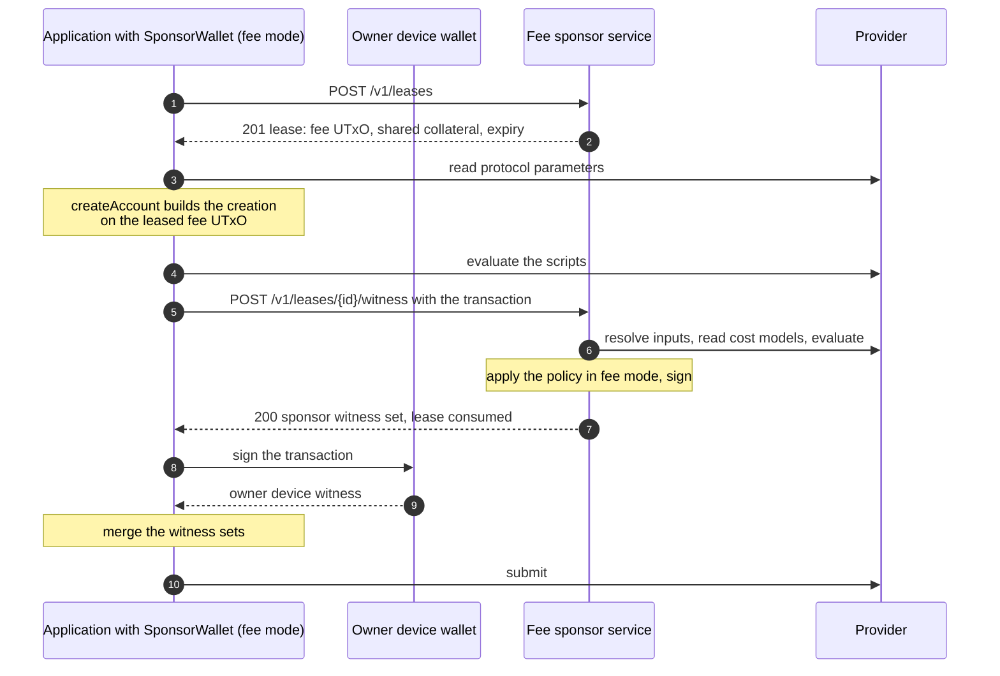
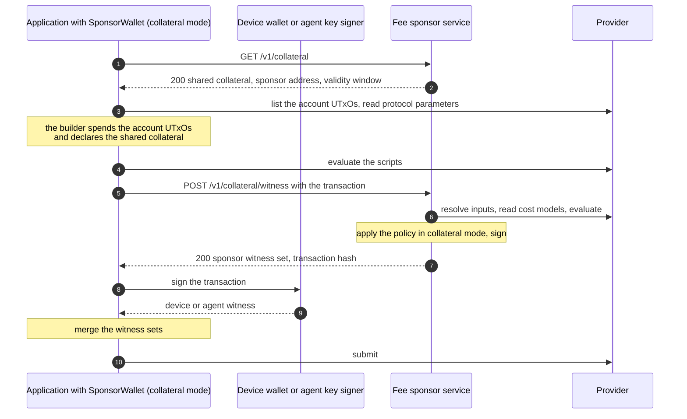
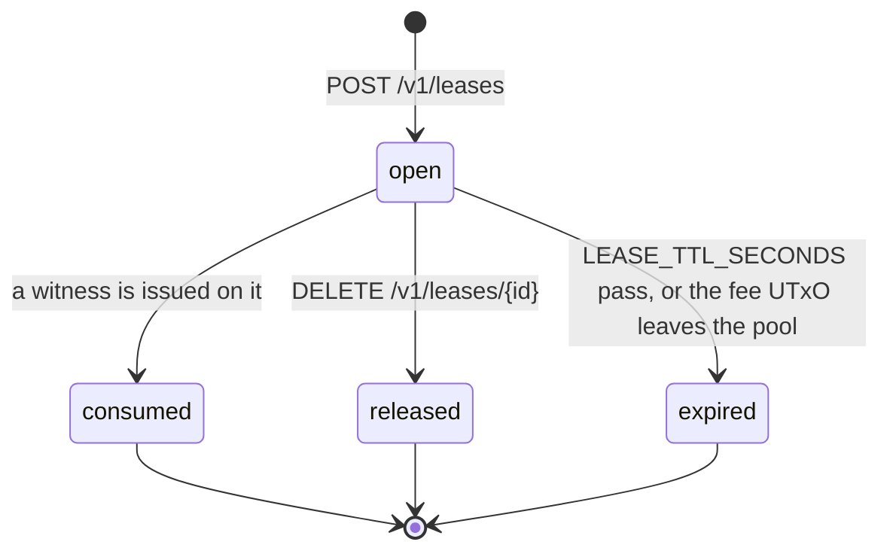

# Flows

This page shows who builds, signs, co-signs and submits in each
[mode](../overview.md#the-two-modes), and how a lease moves through its states.
[api.md](api.md) documents each route the flows call.

In both modes the client builds the transaction and submits it. The service
adds one signature, the sponsor payment key's, after the transaction passes the
[policy](../policy.md).

## Fee mode

A sponsored account [creation](../glossary.md#creation). The application uses
the [client adapter](client-adapter.md) in fee mode as the `sponsor` of the
contract's `createAccount`. The owner's device wallet may hold no ADA.

| Party | Builds | Signs | Pays |
| --- | --- | --- | --- |
| Application | The creation, with the contract's `createAccount` | Nothing | Nothing |
| Owner device wallet | Nothing | As the account's owner, a required signer | Nothing |
| Fee sponsor service | Nothing | As the payer of the fee UTxO | The fee, the stake registration deposit and the control output's lovelace |
| Provider | Nothing | Nothing | Nothing |

The application and the device wallet are often the same program. The diagram
keeps them apart because the device key and the client key are different
secrets.

## Collateral mode

Any account transaction that takes no sponsor value. The application uses the
client adapter in collateral mode as the `collateral` of a contract builder.
The account pays its own fee. On the owner path a device wallet signs. On the
agent path the
[agent key signer](https://github.com/Biglup/cardano-account-custody-contract/blob/main/docs/glossary.md#agent-key-signer)
signs with the agent's key.

| Party | Builds | Signs | Pays |
| --- | --- | --- | --- |
| Application | The operation, with a contract builder | Nothing | Nothing |
| Device wallet or agent key signer | Nothing | As the device or the grantee, a required signer | Nothing |
| Fee sponsor service | Nothing | As the provider of the collateral | Nothing |
| Account | Nothing | Nothing | The fee and the outputs, from its own UTxOs |

The sponsor's collateral is taken only if a script fails in phase two. The
policy refuses a transaction whose scripts do not evaluate within their
budgets, as [POL-11](../policy.md#pol-11-evaluates) states.

## Lease lifecycle

A [lease](../glossary.md#lease) reserves one fee UTxO for one client key. It is
used in fee mode only.

| State | Fee UTxO | `POST /v1/leases/:id/witness` | `DELETE /v1/leases/:id` |
| --- | --- | --- | --- |
| `open` | Leased to this key | Checks the transaction | `200`, the lease becomes `released` |
| `consumed` | Held out of the pool. Spent for good when the witnessed transaction lands. Returns to the pool only as the [restore margin](../glossary.md#restore-margin) states. | `200` with the same witness set for the same transaction, `409 lease_consumed` for another | `409 lease_consumed` |
| `released` | Free for another lease | `410 lease_expired` | `200` |
| `expired` | Free for another lease, or settled by the pool sync | `410 lease_expired` | `410 lease_expired` |

What causes each transition:

- `open` to `consumed`: the witness route issues the lease's one witness. The
  lease and the witness are recorded in one database transaction.
- `open` to `released`: the client calls `DELETE /v1/leases/:id`, or the
  client adapter gives the lease back.
- `open` to `expired`: the lease reaches `expiresAt`. The service closes
  expired leases every 30 seconds, and before it handles any lease request. A
  lease also expires when the [pool sync](../glossary.md#pool-sync) finds its
  fee UTxO gone from the chain, or outside the pool sizes.

`consumed`, `released` and `expired` are final. A refusal never changes the
state.
