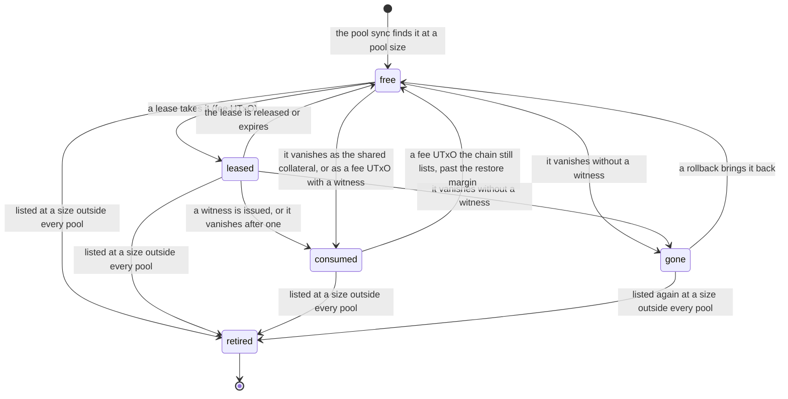

# The pool

The [pool](../glossary.md#pool) is the set of fee UTxOs and collateral UTxOs
the service tracks at the [sponsor address](../glossary.md#sponsor-address).
Everything else at that address is the [reserve](../glossary.md#reserve). A
client can touch only the pool. A [replenish](../glossary.md#replenish) turns
reserve into pool.

## Classification

The [pool sync](../glossary.md#pool-sync) lists the sponsor address through
the provider and classifies each UTxO by its content.

| A UTxO that | Is |
| ----------- | -- |
| holds only lovelace, within a tenth of `FEE_UTXO_LOVELACE` | a [fee UTxO](../glossary.md#fee-utxo) |
| holds only lovelace, within a tenth of `COLLATERAL_UTXO_LOVELACE` | a [collateral UTxO](../glossary.md#collateral-utxo) |
| holds any other amount, or carries any token | reserve |

The pool sync runs at startup and every 30 seconds. It also runs when a lease
or collateral request finds nothing to give, and before and after each
replenish. Each run:

- adds a newly listed fee or collateral UTxO as free;
- settles a UTxO the chain no longer lists, and one that reappears;
- returns a consumed fee UTxO to the pool once its witnesses have lapsed;
- retires a tracked UTxO the chain lists at a size outside every pool;
- keeps the shared collateral designated;
- records the reserve it saw and the time of the run.

## Fee UTxOs

A fee UTxO pays for one account creation in [fee mode](../glossary.md#fee-mode).
A lease reserves the oldest free fee UTxO for one client key, for
`LEASE_TTL_SECONDS`. A fee UTxO backs one open lease at a time.

- A release, or the expiry sweep every 30 seconds, frees the fee UTxO.
- A witness consumes the lease and marks the fee UTxO consumed. The signature
  is out, and the transaction can land at any moment.
- A lease still open on a fee UTxO that vanishes from the chain is closed.

### Restore after the validity lapses

A witnessed transaction can land only until its validity upper bound. Once
the current slot is more than the [restore margin](../glossary.md#restore-margin)
past the bound of every witness issued on a consumed fee UTxO, and the chain
still lists that UTxO, no block can include those transactions. The pool sync
then frees the UTxO and records a `pool` `restored` audit entry.

A witnessed fee UTxO therefore stays out of the pool for at most
`LEASE_TTL_SECONDS` plus `VALIDITY_MARGIN_SECONDS` plus the restore margin,
plus up to one sync interval. With the defaults that is 600 + 120 + 120 + 30
seconds. A fee UTxO whose transaction landed stays consumed: the chain no
longer lists it.

To return a witnessed fee UTxO sooner, spend it from the sponsor wallet. That
invalidates the signature for good.

## Collateral UTxOs

Every witnessed transaction, in both modes, declares the
[shared collateral](../glossary.md#shared-collateral). It is never leased.
The other free collateral UTxOs are [spare collateral](../glossary.md#spare-collateral).

- When no collateral UTxO is designated, the pool sync designates the oldest
  free one. The designation is stored, so it survives restarts.
- A replenish never spends the shared collateral while it is designated,
  whatever the reserve lists. A [pool size change](#changing-the-pool-sizes)
  ends the designation.
  [POL-2](../policy.md#pol-2-sponsor-inputs) refuses it as a regular input.
- The ledger takes collateral only when a script fails in phase two, which
  [POL-11](../policy.md#pol-11-evaluates) prevents.
- When the shared collateral vanishes all the same, the pool sync marks it
  consumed and designates the oldest spare in its place. It records a `pool`
  `collateral_consumed` audit entry naming both, with `next` null when no
  spare is left. It logs `Shared collateral consumed`.
- A consumed shared collateral is never designated again, even when a
  rollback brings it back.
- A spare that vanishes is marked gone, and freed when it reappears.

A transaction built on a shared collateral the pool has replaced fails
[POL-3](../policy.md#pol-3-shared-collateral). The client builds it again on
the current one.

A lease and `GET /v1/collateral` both need a shared collateral. Without one,
they answer 409 `no_utxo_available` when the reserve can fund a collateral
UTxO, and 503 `out_of_funds` when it cannot.

## Lifecycle of a pool UTxO



| Status | Meaning |
| ------ | ------- |
| free | Available. A free fee UTxO can be leased. A free collateral UTxO is the shared collateral or a spare. |
| leased | A fee UTxO held by an open lease. |
| consumed | A fee UTxO with an issued witness, or a shared collateral the chain took. |
| gone | Vanished from the chain without a witness. Freed if it reappears. |
| retired | Outside every pool size. Terminal: never leased, designated or restored. The UTxO is reserve, and a replenish may spend it. |

## Replenishing

A replenish is a transaction from the sponsor wallet to itself. Its inputs
come from the reserve only. It never spends a pool UTxO that is free, leased
or consumed, whatever the reserve lists. It creates fee UTxOs and collateral
UTxOs of the exact sizes, with the change back to the sponsor address.

### While the service runs

```sh
curl --silent --request POST http://127.0.0.1:8787/admin/pool/replenish \
  --header "Authorization: Bearer $ADMIN_API_KEY" \
  --header 'Content-Type: application/json' \
  --data '{}'
```

The body is optional. [api.md](../integrators/api.md#post-adminpoolreplenish)
gives its fields, their defaults and the answers.

The log line `Split submitted` carries the transaction id of a replenish. A
500 `internal_error` after that line does not mean the split failed. It may
still land, and the next pool sync takes up its outputs.
[monitoring.md](monitoring.md#the-audit-trail) says what the audit trail
leaves out.

### While the service is stopped

`npm run replenish` in a checkout, or the image's own entry point, tops the
pool up to the configured targets:

```sh
docker run --rm --env-file /etc/sponsor/env --volume sponsor-data:/data \
  --entrypoint node <image> dist/pool/replenish.js
```

It prints the transaction id and the counts, or that the pool is already at
its targets, then the reserve. It writes the tables the service owns, so run
it only while the service is stopped.

## Sizing

Keep the pool small, sized for the traffic expected, with the reserve holding
what the next replenish needs. A compromise of the host exposes the pool and
the reserve alike, so keep the sponsor wallet small and top it up as it
drains.

- Fee UTxOs: one per creation in flight. Each witnessed fee UTxO stays out of
  the pool for the time [above](#restore-after-the-validity-lapses).
- Collateral UTxOs: one shared and at least one spare, so a consumed shared
  collateral is replaced at once.
- A client key can hold fee UTxOs out of the pool by obtaining witnesses it
  never submits. The witness quota counts the witnesses of the last hour.
  When the hold time is an hour or less, as with the defaults, one key can
  hold up to its `witnessesPerHour` fee UTxOs at once. Its daily sponsored
  lovelace quota can stop it sooner. Keep `witnessesPerHour` below
  `FEE_UTXO_COUNT` for every key.

The defaults break this rule. The default `witnessesPerHour` is 60 and the
default `FEE_UTXO_COUNT` is 10. One key issued with the default quotas can
hold every fee UTxO of a default pool. Size the pool above the largest
`witnessesPerHour` of any key, or issue keys with a `witnessesPerHour` below
`FEE_UTXO_COUNT`.

## Changing the pool sizes

Changing `FEE_UTXO_LOVELACE` or `COLLATERAL_UTXO_LOVELACE` retires every pool
UTxO of the old size on the next pool sync. A lease open on a retired fee
UTxO is closed, and the client's next witness request on it is refused. A
retired shared collateral is replaced by a collateral UTxO of the new size,
once one exists. The former shared collateral is reserve, and a later
replenish may spend it. A witnessed transaction that declares it and has not
landed then fails in phase one, so the chain takes no collateral and the
sponsor loses nothing. Each retirement is a `pool` `retired` audit entry and
a `Pool UTxO retired` log line.

A fee UTxO whose witnessed transaction has not landed is retired as well. A
replenish may then spend it, which invalidates that transaction. To avoid
that:

1. Wait until no fee mode witness is outstanding: the last `witness` `issued`
   entry with a `leaseId` is older than the hold time
   [above](#restore-after-the-validity-lapses). Wait as well until no
   collateral mode witness is outstanding: the last `witness` `issued` entry
   with `mode: collateral` is older than `COLLATERAL_VALIDITY_SECONDS`.
2. Change the sizes and recreate the container, as
   [deployment.md](deployment.md#changing-the-configuration) describes.
3. Replenish, so the pool holds UTxOs of the new sizes.

Retired rows stay retired if the sizes are changed back. A replenish, not a
restore, puts UTxOs of the old size back into the pool.

## Inspecting the pool

`GET /admin/pool` reports the pool, the reserve, the shared collateral and
every free or leased pool UTxO, as
[api.md](../integrators/api.md#get-adminpool) describes.
