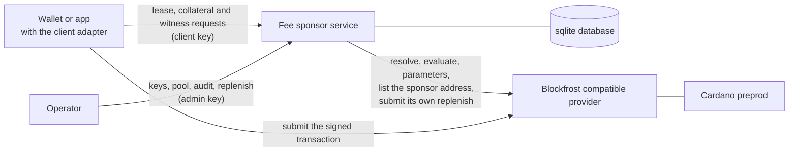

# Overview

The fee sponsor is an HTTP service that holds one funded Cardano wallet, the
[sponsor wallet](glossary.md#sponsor-wallet). It adds that wallet's signature
to transactions that other parties build for the
[account custody contract](https://github.com/Biglup/cardano-account-custody-contract/blob/main/docs/overview.md).
Every transaction must pass a fixed [policy](policy.md) before it is signed.

A custody account is owned by device keys whose holders may have no ADA. The
account still needs ADA in two places. Creating it costs a fee, a stake
registration deposit and the lovelace of its control output. Every transaction
that runs the account's scripts must also declare collateral, which only a
wallet holding ADA can provide. The service supplies both, under the terms
below.

## Where it sits

The client builds the transaction, asks the service for the sponsor's
[witness](glossary.md#witness), adds its own device or agent signatures and
submits the result. The service never submits a client's transaction. It
submits only its own [replenish](glossary.md#replenish) transaction. It reads
the chain and evaluates scripts through one [provider](glossary.md#provider).
It keeps the hashes of client keys, the pool, leases, witnesses and the audit
trail in one sqlite database. The sponsor mnemonic and the admin key come from
the environment. It serves the preprod network only.

The service holds no owner device key and no agent key. An agent's key is held
by the agent key signer, a separate service described in the contract
documentation.

## The two modes

| | Fee mode | Collateral mode |
| --- | --- | --- |
| Serves | An account creation | Any account transaction that takes no sponsor value, a creation the client funds included |
| Route | `POST /v1/leases/:id/witness` | `POST /v1/collateral/witness` |
| Lease | Required | None |
| The sponsor pays | The fee, the stake registration deposit and the control output's lovelace | Nothing |
| The sponsor lends | The shared collateral | The shared collateral |

### Fee mode

The client takes a [lease](glossary.md#lease), which reserves one
[fee UTxO](glossary.md#fee-utxo) for that client alone. It builds the account
creation on the leased fee UTxO and declares the
[shared collateral](glossary.md#shared-collateral). The fee UTxO must be drawn
down by exactly the fee, the deposit and the control output's lovelace. The
rest returns to the sponsor as one change output. The fee is capped at
`MAX_FEE_LOVELACE` and the whole draw at `MAX_SPONSORED_LOVELACE`. The witness
consumes the lease.

Fee mode pays for creations and for nothing else. An operation on an existing
account presented on the lease route is refused, whatever it draws.

### Collateral mode

After creation, the account pays its own fees from its own UTxOs. What its
owner or agent still lacks is collateral. A client that funds a creation
itself can take the same route. The client reads the shared collateral from
`GET /v1/collateral`, builds the transaction and declares that UTxO as its
collateral. The transaction spends no [sponsor UTxO](glossary.md#sponsor-utxo)
and pays nothing to the sponsor. The sponsor's signature authorizes the
collateral and nothing else.

Collateral is taken by the ledger only when a script fails in phase two. The
policy refuses any transaction whose scripts do not evaluate within their
declared budgets, which keeps a witnessed transaction from failing in that
phase. This is why one collateral UTxO can back every transaction at once,
without a lease.

## What the service signs

- An account creation of the custody contract, in fee mode, that spends the
  leased fee UTxO and draws exactly what the creation costs, within the
  configured limits.
- Any account transaction, in collateral mode, that takes no value from the
  sponsor and declares the shared collateral. This covers an operation on an
  existing account and a creation the client funds itself.

In both cases the transaction must name only [known logic](glossary.md#known-logic),
evaluate successfully through the provider, and carry a validity upper bound
within the mode's window.

## What the service never signs

- A transaction that spends a [sponsor UTxO](glossary.md#sponsor-utxo) other
  than the leased fee UTxO, or any sponsor UTxO in collateral mode.
- A transaction whose collateral is anything but the shared collateral
  returned to the sponsor, or that declares itself failing in phase two.
- A transaction that is not a creation or an operation of the custody
  contract, or that runs a script outside the account.
- A transaction naming a logic script the operator has not listed.
- A transaction that sends sponsor value anywhere but the fee, the deposit,
  the account and the sponsor's own change.
- A transaction whose script data hash does not match the redeemers and datums
  it carries.
- A transaction in which a sponsor key is a required signer, or authorizes a
  withdrawal, a certificate or a vote.
- The service never returns a witness set holding anything but the sponsor
  payment key's signature.

[policy.md](policy.md) states each of these as a numbered rule.

## Further reading

- [glossary.md](glossary.md) defines the service's terms.
- [policy.md](policy.md) lists the policy rules in the order they are checked.
- The contract's
  [architecture](https://github.com/Biglup/cardano-account-custody-contract/blob/main/docs/architecture.md)
  explains the proxy, the logic and the stake script the policy reads.
