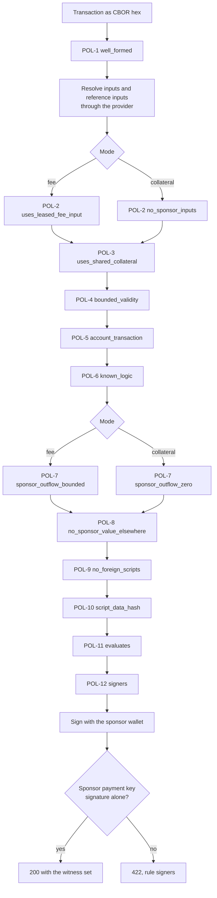

# Policy

The policy is the set of rules a transaction must pass before the service
signs it. Both witness routes apply the same rules in the same order, and the
first rule a transaction breaks is the one reported. The
[mode](glossary.md#fee-mode) changes what two positions check, each under its
own rule name, and the validity window of a third. That gives twelve positions
over fourteen rule names, numbered POL-1 to POL-12 below.

Every refusal answers HTTP 422 with this body, and is recorded on the
[audit trail](glossary.md#audit-trail) under the rule name:

```json
{ "error": "invalid_transaction", "rule": "<rule name>", "detail": "<how the transaction breaks it>" }
```

A refusal in fee mode leaves the lease open, so the client can present a
corrected transaction.



Any position that fails ends the pipeline with a refusal under its rule.

After POL-1 the service resolves every input and reference input through the
[provider](glossary.md#provider) in one lookup. A provider that refuses the
lookup produces a refusal under `evaluates` at that point, before POL-2. No
rule before POL-11 refuses an input for being unknown to the chain; POL-11
does. An earlier rule can still refuse such an input on other grounds. POL-2
refuses one the pool tracks, for example.

The rules below use the glossary's [sponsor UTxO](glossary.md#sponsor-utxo)
and [account script address](glossary.md#account-script-address).

## POL-1 Well formed

- Rule: `well_formed`
- Enforces: the transaction is a Conway transaction of at most 16 KiB that the
  policy can read in full.
- Checks:
  - The transaction is a hex encoded CBOR byte string.
  - It is at most 16 KiB, checked before anything decodes it.
  - It decodes as a Conway transaction.
  - Every field the policy reads is present and correctly shaped.
  - It carries no proposal procedures and no treasury donation.
  - Every Plutus script witness names a known Plutus language, and every voter
    names a credential.
- Why: a field the policy cannot read would otherwise count as empty. No
  account transaction carries a proposal, and a proposal's guardrails script
  would run where the script rules do not look.
- Mode: both.
- Refusal: 422, rule `well_formed`.

## POL-2 Sponsor inputs

- Rules: `uses_leased_fee_input` in fee mode, `no_sponsor_inputs` in
  collateral mode.
- Enforces: the only sponsor UTxO the transaction spends is the leased fee
  UTxO in fee mode, and none in collateral mode.
- Checks:
  - Fee mode: the leased fee UTxO is among the inputs.
  - No input sits at an address whose payment credential cannot be read, such
    as a Byron address.
  - No other input is a sponsor UTxO. The shared collateral spent as a regular
    input is refused here.
- Why: the sponsor's signature authorizes every input its key locks. This
  rule limits what that signature spends.
- Mode: both, under a different name in each.
- Refusal: 422, rule `uses_leased_fee_input` or `no_sponsor_inputs`.

## POL-3 Shared collateral

- Rule: `uses_shared_collateral`
- Enforces: the collateral is exactly the shared collateral, returned to the
  sponsor, and the transaction does not declare itself failing.
- Checks:
  - The transaction is not flagged `is_valid = false`.
  - The collateral inputs are exactly the
    [shared collateral](glossary.md#shared-collateral).
  - A collateral return exists, pays the sponsor address and carries neither a
    datum nor a reference script.
  - Total collateral is set and at most the lovelace the shared collateral
    holds.
- Why: a transaction flagged as failing forfeits its collateral outright. A
  plain return to the sponsor address keeps the collateral spendable by the
  pool. A transaction built on a shared collateral the pool has since
  replaced fails here and must be rebuilt on the current one.
- Mode: both.
- Refusal: 422, rule `uses_shared_collateral`.

## POL-4 Bounded validity

- Rule: `bounded_validity`
- Enforces: the transaction carries a validity upper bound later than the
  current slot and no later than the mode allows.
- Checks:
  - The body sets a validity upper bound.
  - Fee mode: the bound is no later than the slot of the lease expiry plus
    `VALIDITY_MARGIN_SECONDS`. Collateral mode: no later than the slot of the
    time of the check plus `COLLATERAL_VALIDITY_SECONDS`.
  - The bound is later than the current slot.
- Slots are compared as integers. The current slot is read off the service's
  clock with preprod's slot settings, one second per slot.
- Why: a witnessed fee UTxO stays out of the pool until its bound has passed
  by the [restore margin](glossary.md#restore-margin). The bound therefore
  limits how long an unsubmitted transaction holds it. In collateral mode the
  bound keeps a signature from staying valid indefinitely. The verified bound
  is recorded with the witness.
- Mode: both, with the window of each mode.
- Refusal: 422, rule `bounded_validity`.

## POL-5 Account transaction

- Rule: `account_transaction`
- Enforces: the transaction operates an existing custody account, or creates
  one.
- Checks:
  - An input that is not a sponsor UTxO is an account input when it sits at an
    account script address staked to a script and holds a token under the
    account policy named after that script. A 28 byte name is the state NFT of a
    control UTxO. A 32 byte name, the script followed by a slot, is a grant
    token.
  - Every control UTxO among the reference inputs belongs to an account whose
    control UTxO or grant UTxO the transaction spends.
  - Operation: the transaction spends an account input, and every account it
    operates has its control UTxO spent or referenced.
  - Creation: the transaction spends no account input and
    - mints exactly one token under the account policy, of quantity one,
      named with 28 bytes;
    - carries exactly one registration of a script stake credential with an
      explicit deposit;
    - names the minted token after that credential;
    - places the token in exactly one output, at an account script address
      staked to that credential;
    - lists device key hashes in the second field of that output's inline
      datum, at most 8 of them;
    - registers a credential that is the contract's stake script for one of
      those devices, derived from the blueprint at `BLUEPRINT_PATH`.
  - A reference input is never read as an input. One holding an account token
    counts as a control UTxO only at an account script address staked to the
    script its token names.
- Why: the sponsor serves the custody contract alone. The device check stops
  a client from registering a script of its own and having the sponsor pay
  for an account the contract does not govern. The device bound limits how
  many stake scripts one request can make the service derive.
- Mode: both.
- Refusal: 422, rule `account_transaction`.

## POL-6 Known logic

- Rule: `known_logic`
- Enforces: every logic the transaction names is a
  [known logic](glossary.md#known-logic).
- Checks:
  - A logic is named in the first field of the inline datum of every control
    UTxO the transaction spends or references, and of every control output it
    writes.
  - Each such field holds a 28 byte script hash.
  - Each hash is listed in `KNOWN_LOGIC_HASHES`.
- Why: the account proxy runs whatever logic the control datum names. The
  sponsor neither pays for nor lends collateral to an account under rules the
  operator has not read. An upgrade names both the logic it leaves and the
  logic it reaches, so both must be listed while accounts move between them.
- Mode: both.
- Refusal: 422, rule `known_logic`.

## POL-7 Sponsor outflow

- Rules: `sponsor_outflow_bounded` in fee mode, `sponsor_outflow_zero` in
  collateral mode.
- Enforces: in fee mode, the leased fee UTxO pays exactly what an account
  creation costs and nothing else; in collateral mode, the sponsor contributes
  nothing but the collateral.
- Checks in fee mode:
  - The transaction is a creation. An operation is refused, whatever it draws.
  - The fee is at most `MAX_FEE_LOVELACE`.
  - No output to the sponsor address carries a datum or a reference script.
  - Exactly one output pays the sponsor address.
  - The leased fee UTxO's lovelace less that output's lovelace equals the fee
    plus the registration deposit plus the control output's lovelace.
  - That amount is at most `MAX_SPONSORED_LOVELACE`.
- Checks in collateral mode:
  - No output pays the sponsor payment key, at any address.
  - No withdrawal draws from the sponsor's reward account.
- Why: this rule bounds what one witness costs the sponsor. A single plain
  change output keeps the remainder in a shape the pool can spend, instead of
  scattering it into the reserve. In collateral mode the fee is the account's
  and the service does not cap it.
- Mode: both, under a different name in each.
- Refusal: 422, rule `sponsor_outflow_bounded` or `sponsor_outflow_zero`.

## POL-8 No sponsor value elsewhere

- Rule: `no_sponsor_value_elsewhere`
- Enforces: every output that pays neither the sponsor address nor an account
  script address is covered, asset by asset, by value that is not the sponsor's.
- Checks:
  - The supply is the value of every input that is not a sponsor UTxO, plus
    the lovelace of every withdrawal not drawn from the sponsor's reward
    account.
  - For each asset, the outputs to third parties hold no more than that
    supply.
- Why: sponsor value can then reach only the fee, the deposit, the account and
  the sponsor's own change, never a third party.
- Mode: both.
- Refusal: 422, rule `no_sponsor_value_elsewhere`.

## POL-9 No foreign scripts

- Rule: `no_foreign_scripts`
- Enforces: every script the transaction runs or attaches belongs to the
  account.
- The account's scripts are the account proxy (`ACCOUNT_SCRIPT_HASH`) and the
  account's stake scripts. A stake script belongs to the account when a
  control UTxO the transaction spends or references is named after it, or
  when a creation registers it. The logics named under POL-6 are admitted
  where the checks say.
- Checks:
  - Every input locked by a script is locked by the account proxy.
  - Every minting policy is the account proxy.
  - Every script credential a certificate names is the proxy or an account
    stake script.
  - No reward account is withdrawn from twice.
  - Every withdrawal from a script reward account names the proxy, an account
    stake script or a named logic.
  - A withdrawal that runs a named logic draws zero lovelace.
  - Every script voter is the proxy or an account stake script.
  - The transaction carries no native script witness.
  - Every attached Plutus script is the proxy, an account stake script or a
    named logic.
- Why: a script outside the account could authorize actions or move value
  the policy does not model. Referencing a UTxO where a logic is parked does
  not admit that logic; only a control datum does.
- Mode: both.
- Refusal: 422, rule `no_foreign_scripts`.

## POL-10 Script data hash

- Rule: `script_data_hash`
- Enforces: the script data hash in the body matches the redeemers and datums
  the witness set carries.
- Checks:
  - The witness set can be read for its redeemers and datums.
  - With neither redeemers nor datums, the body carries no script data hash.
  - With either, the body carries one.
  - When the witness set carries redeemers or datums, every Plutus script is
    Plutus V3. This covers every attached Plutus script and every Plutus
    reference script on an input or a reference input. A native reference
    script names no Plutus language and is not refused here.
  - The hash recomputed from the witness set, with the cost models the
    provider reports, equals the hash in the body.
- Why: the sponsor's signature covers the body but not the witness set. The
  hash in the body is what binds the evaluated redeemers to the signed
  transaction. Without this rule a client could have one set of redeemers
  evaluated and attach another after signing.
- Mode: both.
- Refusal: 422, rule `script_data_hash`.

## POL-11 Evaluates

- Rule: `evaluates`
- Enforces: the transaction's scripts evaluate successfully through the
  provider, within the budgets the redeemers declare.
- Checks:
  - Every input and every reference input is an unspent output the chain
    knows.
  - The provider evaluates the transaction, with the leased fee UTxO in fee
    mode and the shared collateral supplied as sponsor UTxOs.
  - Every redeemer has an evaluation result.
  - Every redeemer declares at least the memory and the steps that result
    needs.
- Why: collateral is taken only when a script fails in phase two. A
  transaction that passes this rule can fail only in phase one, which takes
  no collateral. This rule also runs the contract's own scripts, which refuse
  transactions the structural rules cannot tell apart, such as one mixing the
  owner path and the agent path.
- Mode: both.
- Refusal: 422, rule `evaluates`.

## POL-12 Signers

- Rule: `signers`
- Enforces: the sponsor signs as a payer only.
- Checks:
  - Neither the sponsor payment key nor the sponsor stake key is a required
    signer.
  - No withdrawal draws from the sponsor's reward account.
  - No certificate names a sponsor key, in any role.
  - No voter is a sponsor key.
  - After signing, the witness set holds exactly one signature, by the sponsor
    payment key.
- Why: a sponsor signature that satisfies a required signer, a certificate or
  a vote would authorize an action beyond paying.
- Mode: both.
- Refusal: 422, rule `signers`.
